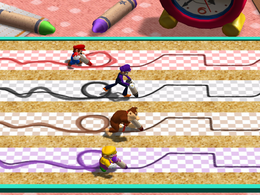

# Trace Race CV

A computer vision based version of the Mario Party mini-game 'Trace Race' (pictured below).  Game will implement object tracking for players to choose how they want to trace the course.

  

## Gameplay concept/progress:

### Play online with Flask built frontend*

**Not yet hosted anywhere.*

  

  *hoodie by <a href='https://www.eskibrand.com'>eski</a>

### Play locally with OpenCV's GUI*

**Below example gif has a bug in coverage scoring; bug is fixed but didn't feel like re-recording gif.*

  

